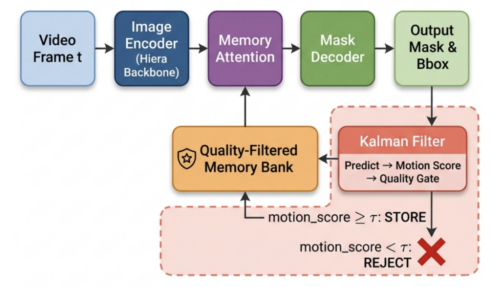
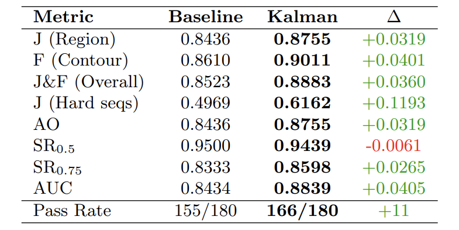
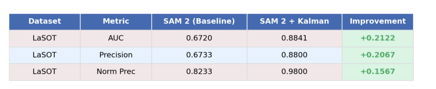

<div align="center">

# Motion-Aware SAM 2

### Kalman Filter Enhanced Video Object Segmentation with Occlusion Handling


[**Paper**](#method-overview) | [**Results**](#experimental-results) | [**Installation**](#installation) | [**Usage**](#usage) | [**Demo Video**](https://youtube.com/your-video-link)

</div>

---

## Highlights

- **Training-Free Enhancement** - No GPU training required; works directly with pretrained SAM 2 weights
- **Motion-Aware Tracking** - Kalman filter predicts object motion for robust mask selection
- **Occlusion Handling** - 4-state tracking system (VISIBLE → UNCERTAIN → OCCLUDED → LOST)
- **Quality-Gated Memory** - Prevents error accumulation by filtering unreliable frames
- **+3.19% on GOT-10k** and **+11.61% on LaSOT** over baseline SAM 2.1

---

## Visual Comparison

<div align="center">


*Left: SAM 2.1 Baseline (loses track during occlusion) | Right: Motion-Aware SAM 2 (maintains tracking)*

</div>

---

## Method Overview

We enhance SAM 2's video object segmentation by integrating a Kalman filter for motion prediction and a state machine for occlusion handling. Our method addresses SAM 2's tendency to lose track during occlusions and fast motion.

<div align="center">



</div>

### Architecture

```
┌─────────────────────────────────────────────────────────────────────────────┐
│                        Motion-Aware SAM 2 Pipeline                          │
├─────────────────────────────────────────────────────────────────────────────┤
│                                                                             │
│   ┌──────────┐      ┌──────────────┐      ┌─────────────┐      ┌─────────┐ │
│   │  Frame   │ ───► │  SAM 2       │ ───► │  Memory     │ ───► │ Mask    │ │
│   │  Input   │      │  Encoder     │      │  Attention  │      │ Decoder │ │
│   └──────────┘      └──────────────┘      └──────┬──────┘      └────┬────┘ │
│                                                  │                   │      │
│                                                  │                   ▼      │
│   ┌──────────────────────────────────────────────┴───────┐    ┌──────────┐ │
│   │              Quality-Gated Memory Bank               │    │  Mask    │ │
│   │  (Only high-confidence frames added to memory)       │    │Candidates│ │
│   └──────────────────────────────────────────────────────┘    └────┬─────┘ │
│                              ▲                                      │      │
│                              │                                      ▼      │
│                    ┌─────────┴─────────┐              ┌──────────────────┐ │
│                    │   State Machine   │◄─────────────│  Kalman Filter   │ │
│                    │                   │              │  Motion Scoring  │ │
│                    │ VISIBLE/UNCERTAIN │              └──────────────────┘ │
│                    │ OCCLUDED/LOST     │                       │           │
│                    └───────────────────┘                       ▼           │
│                                                        ┌──────────────┐    │
│                                                        │ Best Mask +  │    │
│                                                        │ Bounding Box │    │
│                                                        └──────────────┘    │
└─────────────────────────────────────────────────────────────────────────────┘
```

### Kalman Filter State Model

We use an **8-dimensional state vector** for motion prediction:

```
State Vector: [cx, cy, w, h, vx, vy, vw, vh]
               └─ position ─┘  └─ velocity ─┘

• cx, cy : Center coordinates
• w, h   : Width and height
• vx, vy : Velocity components
• vw, vh : Size change rate
```

**Prediction Step** (Constant Velocity Model):
```
x̂ₜ = F · xₜ₋₁    where F is the state transition matrix
```

**Update Step** (Kalman Correction):
```
xₜ = x̂ₜ + K · (zₜ - H · x̂ₜ)    where K is the Kalman gain
```

### Tracking State Machine

Our 4-state tracking system handles varying confidence levels:

```
                         conf > 0.7                    conf > 0.7
          ┌─────────────────────────────┐  ┌─────────────────────────────┐
          │                             │  │                             │
          ▼                             │  ▼                             │
    ┌───────────┐                 ┌─────┴─────┐                 ┌────────┴──┐
    │  VISIBLE  │ ──────────────► │ UNCERTAIN │ ──────────────► │ OCCLUDED  │
    │           │   conf < 0.7    │           │   conf < 0.3    │           │
    │ Trust SAM │                 │   Blend   │                 │  Kalman   │
    │  Directly │                 │ SAM+Kalman│                 │   Only    │
    └───────────┘                 └───────────┘                 └─────┬─────┘
                                                                      │
                                                               conf < 0.15
                                                                      │
                                                                      ▼
                                                                ┌──────────┐
                                                                │   LOST   │
                                                                │          │
                                                                │Re-detect │
                                                                └──────────┘
```

### Mask Selection Scoring

```
M* = argmax( α · motion_score + (1-α) · appearance_score )

where:
  • motion_score    = IoU(kalman_predicted_bbox, candidate_bbox)
  • appearance_score = SAM 2 confidence score
  • α = 0.15 (motion weight hyperparameter)
```

---

## Experimental Results

### GOT-10k Validation Set (180 sequences)

<div align="center">



</div>

| Method | J (IoU) | F (Boundary) | J&F | SR₀.₅ | SR₀.₇₅ | AUC |
|:-------|:-------:|:------------:|:---:|:-----:|:------:|:---:|
| SAM 2.1 Baseline | 84.36 | 86.10 | 85.23 | 95.00 | 83.33 | 84.34 |
| **Motion-Aware SAM 2 (Ours)** | **87.55** | **90.11** | **88.83** | **94.39** | **85.98** | **88.39** |
| **Improvement** | **+3.19%** | **+4.01%** | **+3.60%** | -0.61% | **+2.65%** | **+4.05%** |

### LaSOT Dataset

<div align="center">



</div>

| Method | J (IoU) | Improvement |
|:-------|:-------:|:-----------:|
| SAM 2.1 Baseline | 51.55% | - |
| **Motion-Aware SAM 2 (Ours)** | **57.63%** | **+11.61%** |

### Key Observations

- **Significant improvement on challenging sequences** with occlusions and fast motion
- **LaSOT shows larger gains** (+11.61%) due to longer sequences with more occlusion events
- **Consistent improvement** across J, F, and combined J&F metrics

---

## Installation

### Prerequisites

- Python 3.10+
- CUDA-compatible GPU (recommended: 8GB+ VRAM)
- Linux/macOS (Windows with WSL2)

### Step 1: Clone Repository

```bash
git clone https://github.com/darshpatel1052/DL-Project-SAM2.git
cd DL-Project-SAM2
```

### Step 2: Create Virtual Environment

```bash
python -m venv venv
source venv/bin/activate  # Linux/macOS
# or
venv\Scripts\activate     # Windows
```

### Step 3: Install Dependencies

```bash
pip install -r requirements.txt
```

### Step 4: Install SAM 2

```bash
# Option A: From PyPI (easier)
pip install sam2

# Option B: From source (recommended for development)
git clone https://github.com/facebookresearch/sam2.git
cd sam2 && pip install -e . && cd ..
```

### Step 5: Download Model Checkpoint

Download `sam2.1_hiera_small.pt` from [SAM 2 Model Zoo](https://github.com/facebookresearch/sam2#model-checkpoints):

```bash
mkdir -p models
wget -O models/sam2.1_hiera_small.pt https://dl.fbaipublicfiles.com/segment_anything_2/092824/sam2.1_hiera_small.pt
```

---

## Dataset Setup

### GOT-10k

1. Register at [GOT-10k Official Site](http://got-10k.aitestunion.com/)
2. Download the **validation split**
3. Extract to `datasets/got10k/val/`

```
datasets/
└── got10k/
    └── val/
        ├── GOT-10k_Val_000001/
        │   ├── 00000001.jpg
        │   ├── 00000002.jpg
        │   └── groundtruth.txt
        ├── GOT-10k_Val_000002/
        └── ...
```

### LaSOT

1. Download from [LaSOT Official Site](http://vision.cs.stonybrook.edu/~lasot/)
2. Extract to `datasets/lasot_small/`

```
datasets/
└── lasot_small/
    └── small_LaSOT/
        ├── basketball/
        ├── car/
        └── ...
```

---

## Usage

### Quick Start

```bash
# Run evaluation on GOT-10k (5 sequences for quick test)
python evaluation/eval_Phase2_Improved.py --dataset got10k_val --max-sequences 5

# Run full evaluation
python evaluation/eval_Phase2_Improved.py --dataset got10k_val
```

### Detailed Usage

#### 1. Baseline Evaluation

Run pure SAM 2.1 without our enhancements:

```bash
python evaluation/eval_baseline.py \
    --dataset got10k_val \
    --max-sequences 180
```

#### 2. Motion-Aware Evaluation (Our Method)

Run with Kalman filter and state machine:

```bash
python evaluation/eval_Phase2_Improved.py \
    --dataset got10k_val \
    --confidence-threshold 0.7 \
    --occlusion-threshold 0.3 \
    --lost-threshold 0.15 \
    --recovery-frames 5
```

**Parameters:**
| Parameter | Default | Description |
|-----------|---------|-------------|
| `--confidence-threshold` | 0.7 | Threshold for VISIBLE state |
| `--occlusion-threshold` | 0.3 | Threshold for OCCLUDED state |
| `--lost-threshold` | 0.15 | Threshold for LOST state |
| `--recovery-frames` | 5 | Frames to attempt recovery |
| `--chunk-size` | 200 | Frames per processing chunk |

#### 3. Generate Comparison Plots

```bash
python utils/plots.py
```

Output saved to `results/plots/`:
- `metrics_comparison.png` - Bar chart of all metrics
- `success_curve.png` - Success plot with AUC
- `radar_chart.png` - Multi-metric radar chart
- `improvement_distribution.png` - Per-sequence improvements

#### 4. Using Shell Script

```bash
chmod +x run_phase2_eval.sh
./run_phase2_eval.sh
```

---

## Project Structure

```
motion_aware_sam2/
│
├── configs/
│   ├── __init__.py
│   └── config.py                 # Hyperparameters and paths
│
├── datasets/
│   ├── __init__.py
│   ├── dataset_loaders.py        # GOT-10k and LaSOT data loaders
│   └── setup_datasets.py         # Dataset download utilities
│
├── models/
│   ├── __init__.py
│   ├── kalman_filter.py          # 8D Kalman filter implementation
│   ├── sam2_tracker.py           # SAM 2 video predictor wrapper
│   ├── baseline.py               # Pure SAM 2 baseline tracker
│   └── Phase2_Improved.py        # Motion-aware tracker with state machine
│
├── evaluation/
│   ├── __init__.py
│   ├── metrics.py                # J, F, J&F, AO, SR, AUC metrics
│   ├── eval_baseline.py          # Baseline evaluation script
│   ├── eval_Phase2_Improved.py   # Our method evaluation script
│   └── failure_capture.py        # Failure case analysis
│
├── utils/
│   ├── __init__.py
│   ├── visualization.py          # Video and mask visualization
│   ├── plots.py                  # Comparison plot generation
│   └── src/                      # README assets
│       ├── pipeline.png
│       ├── got10k.png
│       ├── lasot.png
│       └── dl_video_comparision.gif
│
├── results/                      # Evaluation outputs
│   ├── got10k_val_Phase2_Improved_evaluation.json
│   ├── lasot_Phase2_Improved_evaluation.json
│   └── plots/
│
├── requirements.txt
├── run_phase2_eval.sh
├── LICENSE
└── README.md
```

---

## Configuration

Key hyperparameters in `configs/config.py`:

```python
# Kalman Filter Settings
KALMAN_CONFIG = {
    "dim_x": 8,                    # State dimension [x,y,w,h,vx,vy,vw,vh]
    "dim_z": 4,                    # Measurement dimension [x,y,w,h]
    "alpha_motion": 0.15,          # Motion score weight in mask selection
    "process_noise_position": 1.0, # Trust in motion model
    "measurement_noise": 1.0,      # Trust in SAM 2 output
}

# Tracking State Thresholds
STATE_CONFIG = {
    "tau_visible": 0.7,            # VISIBLE threshold
    "tau_uncertain": 0.3,          # UNCERTAIN → OCCLUDED threshold
    "tau_lost": 0.15,              # OCCLUDED → LOST threshold
}

# Quality-Gated Memory
MEMORY_CONFIG = {
    "tau_mask_iou": 0.5,           # Min mask confidence for memory
    "tau_motion": 0.7,             # Min motion score for memory
    "tau_occlusion": 0.5,          # Max occlusion score for memory
}
```

---

## Evaluation Metrics

We use standard VOS/VOT metrics from the SAM 2 paper:

| Metric | Description | Formula |
|--------|-------------|---------|
| **J (Jaccard)** | Region similarity (IoU) | TP / (TP + FP + FN) |
| **F (F-measure)** | Boundary accuracy | 2·P·R / (P + R) |
| **J&F** | Combined metric | (J + F) / 2 |
| **AO** | Average Overlap (GOT-10k) | Mean IoU across frames |
| **SR₀.₅** | Success Rate @ 0.5 | % frames with IoU > 0.5 |
| **SR₀.₇₅** | Success Rate @ 0.75 | % frames with IoU > 0.75 |
| **AUC** | Area Under Success Curve | ∫ SR(τ) dτ |

---

## References

```bibtex
@article{ravi2024sam2,
  title={SAM 2: Segment Anything in Images and Videos},
  author={Ravi, Nikhila and Gabber, Valentin and Hu, Yuan-Ting and others},
  journal={arXiv preprint arXiv:2408.00714},
  year={2024}
}

@article{yang2024samurai,
  title={SAMURAI: Adapting Segment Anything Model for Zero-Shot Visual Tracking},
  author={Yang, Cheng-Yen and Huang, Hsiang-Wei and others},
  journal={arXiv preprint arXiv:2411.11922},
  year={2024}
}

@article{huang2019got10k,
  title={GOT-10k: A Large High-Diversity Benchmark for Generic Object Tracking},
  author={Huang, Lianghua and Zhao, Xin and Huang, Kaiqi},
  journal={IEEE TPAMI},
  year={2019}
}

@inproceedings{fan2019lasot,
  title={LaSOT: A High-quality Benchmark for Large-scale Single Object Tracking},
  author={Fan, Heng and Lin, Liting and others},
  booktitle={CVPR},
  year={2019}
}
```

---


## Acknowledgments

- [SAM 2](https://github.com/facebookresearch/sam2) by Meta AI Research
- [SAMURAI](https://github.com/yangchris11/samurai) for Kalman filter inspiration
- GOT-10k and LaSOT benchmark teams

---

<div align="center">


</div>
